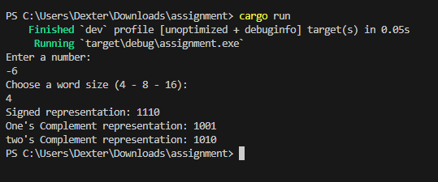

# This is my assignment for my Microprocessors class
I have implemented a plethora of binary representations, including:-
1. Unsigned
2. Signed
3. 1's complement
4. 2's complement

In addition to showing factorials, but only for positive numbers, I have decided to use **Rust** for this project as a change for me to hone my understanding of the language

## Guide for use
using a **Rust** language compiler, you type `cargo run` in the terminal, it will build, then ask you to type a number like following:-

